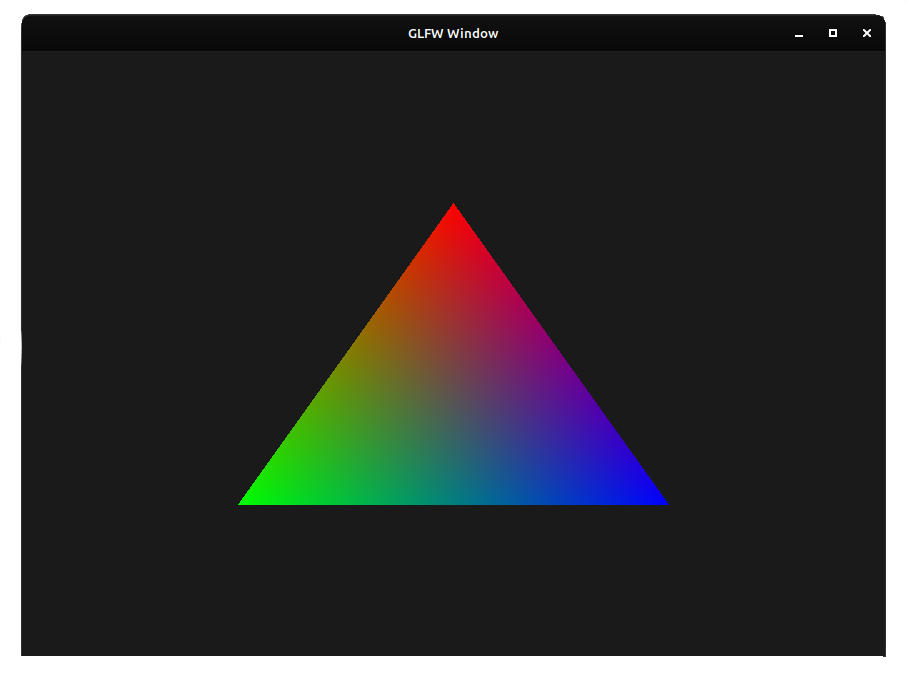

# HRenderer
**THIS IS A WORK IN PROGRESS, THIS PROJECT IS STILL WAY TOO BAREBONES.**
**Everything here is subject to changes. Most of the text here wasn't even added yet.**

    

So, this is a project that I'm making to learn OpenGL and rendering. If you want to set this up, run `make cmake_setup_ninja`(this is the preferred way to do it, you can do `make cmake_setup` if you prefer Make).

For debugging(building and then running the project), run `make` or `make debug`. This will automatically build the project with CMake and run it in the `./Build` directory.

This project is supposed to be a general engine, so you can use as a game engine, physics engine, you choose. It gives you rendering and a scene system. This is mostly a framework, so you gotta make most of the stuff, so good luck with it. There's ECS support, so use that well.

### Dependencies
- GLFW
- OpenGL(of course)
- Electricity and a computer(with OpenGL 3), maybe 8+ hours of sleep as well

### Contributing
Don't.